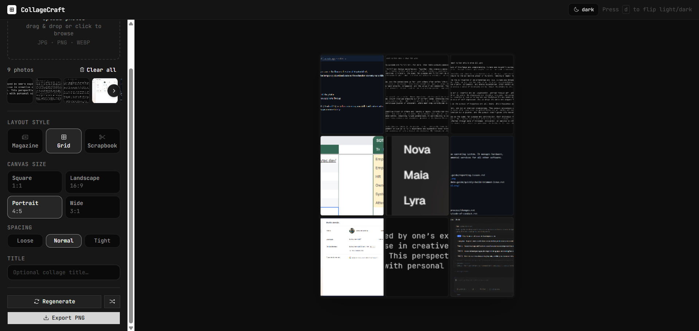

# Collage Craft

A web application that automatically generates polished photo collages in the browser. Upload multiple photos and Collage Craft ranks them with lightweight heuristics, then arranges them into clean editorial-style layouts.



## Features

- **Multi-image upload** — drag-and-drop or file picker, supports JPG, PNG, WEBP
- **3 layout styles** — Magazine (editorial hero), Grid (clean uniform), Scrapbook (playful rotated)
- **Heuristic photo scoring** — ranks images by resolution, aspect ratio, file size, and orientation diversity
- **Live preview** — collage updates instantly as you change settings
- **Export** — download as a high-quality 2× PNG
- **Theme toggle** — switch between light, dark, and system modes
- **Export feedback** — Sonner toasts confirm export progress and failures

## Tech stack

- **Frontend** — React 19 + TypeScript + Vite
- **Styling** — Tailwind CSS v4 + shadcn/ui patterns
- **Runtime and tooling** — Bun, ESLint, Prettier, TypeScript
- **Rendering** — HTML canvas for preview and PNG export

## Getting started

### Prerequisites

- [Bun](https://bun.sh/) (or npm/pnpm/yarn)

### Install and run

```bash
# Install dependencies
bun install

# Start development server
bun dev
```

Open http://localhost:5173 in your browser.

### Build for production

```bash
bun run build
bun run preview   # preview the production build
```

### Other commands

```bash
bun run lint       # ESLint
bun run test       # Bun test suite
bun run typecheck  # TypeScript type check only
bun run format     # Prettier
```

## How it works

1. Upload photos with drag-and-drop or the file picker.
2. The app reads image metadata and creates lightweight object URLs for previews.
3. Photos are ranked with a simple heuristic scorer.
4. The layout engine arranges them into `magazine`, `grid`, or `scrapbook` compositions.
5. The canvas preview updates live as you change style, size, spacing, or title.
6. Export renders the collage to a high-resolution PNG and starts the download automatically.

## Project structure

```
src/
├── types/
│   └── index.ts              # Shared interfaces: Photo, LayoutTile, CollageSettings, …
├── lib/
│   ├── constants.ts          # Canvas presets, density gaps, default settings
│   ├── scoring.ts            # Photo scoring module and ranking helpers
│   ├── layout-engine.ts      # Grid / Magazine / Scrapbook layout generators
│   └── canvas-renderer.ts    # Canvas 2D rendering + PNG export
├── hooks/
│   ├── use-photo-upload.ts   # Object URL creation, drag-drop, Photo object creation
│   ├── use-collage.ts        # Orchestrates scoring → layout → state
│   ├── use-canvas-export.ts  # Triggers 2× PNG download + toast feedback
│   └── use-is-dark.ts        # Resolved dark-mode boolean (handles "system" setting)
├── components/
│   ├── canvas/
│   │   ├── collage-canvas.tsx # <canvas> element + live re-render
│   │   └── empty-state.tsx    # Placeholder before photos are uploaded
│   ├── controls/
│   │   ├── controls-panel.tsx # Full sidebar assembly
│   │   ├── style-selector.tsx # Magazine / Grid / Scrapbook picker
│   │   └── canvas-size-control.tsx
│   └── upload/
│       ├── upload-zone.tsx    # Drag-and-drop area
│       └── photo-strip.tsx    # Scrollable thumbnail row
└── app.tsx                    # Top-level layout and state wiring
```

## How photo scoring works

Collage Craft uses a simple heuristic scorer to decide which photos should be featured first in a layout.

The scorer ranks each photo based on:
| Factor | Weight | Rationale |
|---|---|---|
| Resolution (pixels) | 35% | More pixels = richer image |
| Aspect ratio fit | 30% | Common ratios (16:9, 4:3, 3:2…) score higher |
| File size | 20% | Proxy for compression quality |
| Orientation diversity | 15% | Bonus for photos that diversify the mix |

These scores are then used to keep stronger photos near the front of the layout while still allowing some seeded variation in the final arrangement.

## Current limitations

- No backend or cloud sync; everything runs locally in the browser
- No saved projects or persistent collage sessions
- No manual photo pinning or drag-to-reorder yet
- Scoring is intentionally simple and heuristic-based
